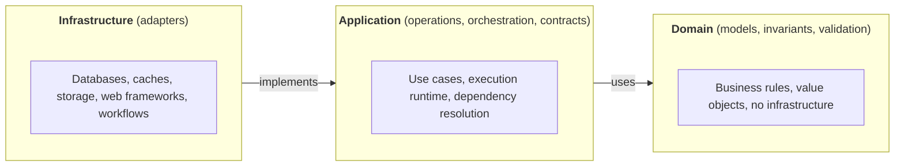
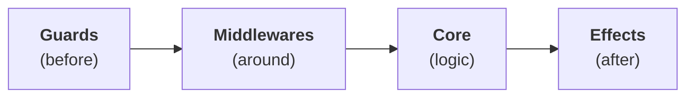
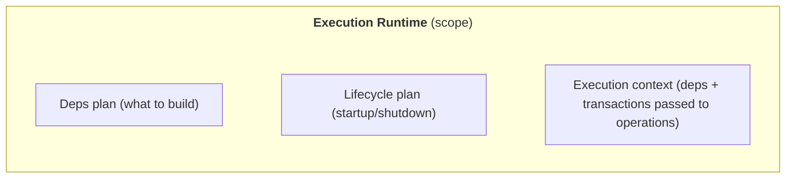
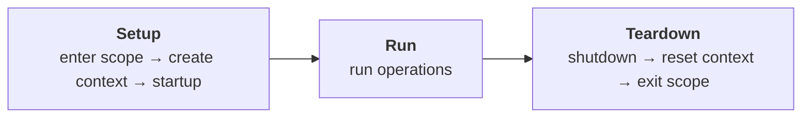
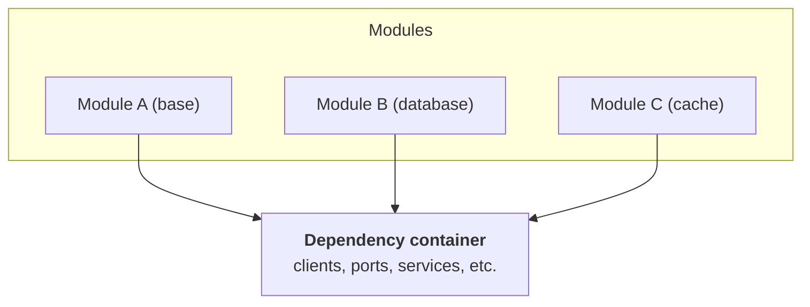
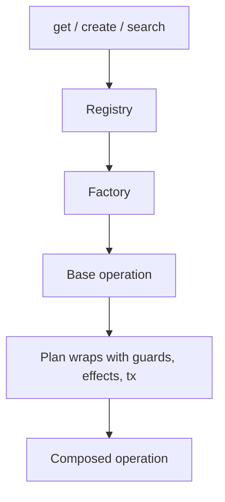
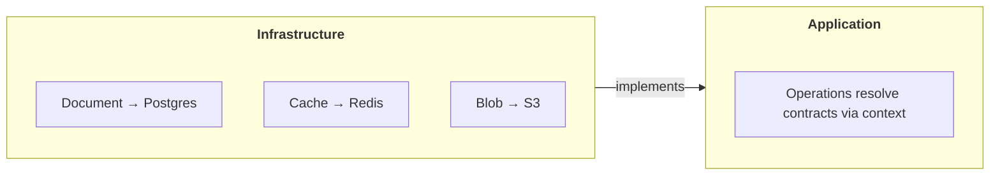

# Core Concepts

This document explains the foundational ideas behind Forze: how it structures backend services, what patterns it uses, and why they matter. It is intended for both **users** integrating Forze into their projects and **contributors** extending or maintaining the library.

The concepts described here are meant to be **stable** — they reflect the design philosophy and architectural choices that persist even as the implementation evolves. Specific class names, module paths, or API details may change; the underlying ideas should not.

## Overview

Forze is a **structural foundation** for backend services. It does not impose a specific framework or database; instead, it provides:

- **Layered architecture** — domain, application, and infrastructure with clear boundaries
- **Contracts and adapters** — interfaces that decouple business logic from technology choices
- **Composable operations** — business logic as first-class, testable units
- **Declarative configuration** — plans and specs instead of imperative wiring

The result: you can swap databases, add caching, or change web frameworks without rewriting business logic.

## Layered Architecture

Forze organizes code into three layers. Dependencies flow **inward**: infrastructure depends on application, application depends on domain. The domain layer has no external dependencies.

**Why it matters:** Each layer has a clear responsibility. Domain logic stays pure and testable. Application orchestrates without knowing storage details. Infrastructure can be swapped or extended without touching business rules.

## Domain Layer

The domain layer holds **business logic and invariants**. It knows nothing about databases, HTTP, or external services.

| Concept | Purpose |
|---------|---------|
| **Versioned entities** | Aggregates with revisions, timestamps, identity; updates produce new revisions, not in-place mutation. Supports optimistic concurrency and audit trails. |
| **Value objects & commands** | Immutable inputs/outputs; read models may differ from domain models. Enables independent evolution of queries and writes. |
| **Pluggable validation** | Hooks that run on update (previous state, new state, patch). Invariants stay close to the model. |
| **Mixins** | Reusable concerns (soft delete, naming, numbering) composed without deep inheritance. |

**Why it matters:** Business rules live in one place. The domain is testable in isolation. Changes to infrastructure do not ripple into business logic.

## Application Layer

The application layer **orchestrates** domain logic and coordinates infrastructure. It defines *what* happens, not *how* persistence or transport work.

### Operations (Use Cases)

An **operation** is a single, well-defined business action. It takes arguments and returns a result. Operations support composition via guards, effects, and middlewares:

| Hook | When | Purpose |
|------|------|---------|
| **Guards** | Before execution | Validate or enrich arguments |
| **Middlewares** | Around execution | Retries, metrics, cross-cutting concerns |
| **Effects** | After execution | Logging, indexing, events |

Composition is **immutable** — adding a guard or effect returns a new instance. **Transactional operations** add explicit transaction boundaries and support **side guards/effects** that run outside the transaction (e.g. send notification only after commit).

### Execution Runtime

The **execution runtime** is the runnable scope where operations run. It combines three elements and follows a clear lifecycle:

**Why it matters:** Dependencies and lifecycle are configured once, declaratively. Operations receive a context and resolve what they need. No global state, no hidden coupling.

### Dependency Plan

The **dependency plan** describes how to build the dependency container. Modules produce dependencies; plans compose (e.g. base + database + cache). The runtime builds the container before any operation runs.

Dependencies are **not** limited to contracts — the container can hold raw clients, custom services, implementations, or parameterized factories. **Dependency routers** select the right implementation when resolution depends on a parameter (e.g. aggregate type) or when multiple adapters exist for the same contract.

### Operation Registry and Plan

The **operation registry** maps names to factories; the **operation plan** describes how each operation is composed (guards, effects, middlewares). Resolution applies both:

Plans are keyed by operation name, mergeable and extensible. A base plan (wildcard) might add logging to all operations; a specific plan might add authorization to “create” only. Per-operation plans extend the base plan; **priorities** control the order of hooks when merged. Transactional operations support in-tx and after-commit buckets.

**Why it matters:** Operations are registered once; composition is declared in plans. Add auditing, idempotency, or custom behavior by extending the plan, without touching the core operation.

## Contracts and Adapters (Hexagonal Architecture)

**Contracts** (also called ports) are interfaces defined by the application. **Adapters** are implementations provided by infrastructure. The application depends on contracts, not adapters.

| Contract | Purpose |
|----------|---------|
| Document storage | Read, write, search for document aggregates (split into read/write/search ports) |
| Transaction manager | Begin, commit, rollback; scoped ports participate in active transaction |
| Document cache | Optional caching for document read models |
| Blob storage | Store and retrieve files (S3-style) |
| Counters | Distributed increment (e.g. sequence numbers) |
| Idempotency | Track and deduplicate requests |
| Streams | Publish and consume events |
| Workflows | Orchestrate long-running processes |
| Tenant context | Ambient tenant identity for multi-tenant routing |
| Actor context | Ambient actor identity for audit and creator injection |

The application defines contracts; infrastructure provides adapters that implement them. The dependency plan wires adapters to contracts. Switching from Postgres to Mongo means changing the plan, not the operations.

### Aggregate Specification

For document-like aggregates, a **specification** binds together what adapters need to configure themselves:

| Spec element | Purpose |
|--------------|---------|
| Namespace | Cache key prefix |
| Storage relations | Read/write/history relation names (tables, views) |
| Model types | Read model, domain model, create command, update command |
| Features | Search config, soft delete, caching |

You define the spec once. Switching adapters means swapping the implementation, not rewriting the spec.

**Why it matters:** Business logic talks to contracts. Infrastructure implements them. Technology choices stay at the edges. Tests stub contracts with in-memory or fake implementations.

Forze gives you a **structural foundation** — concepts and patterns that keep backend code clean, modular, and maintainable as it grows. The specifics may evolve; the ideas endure.
