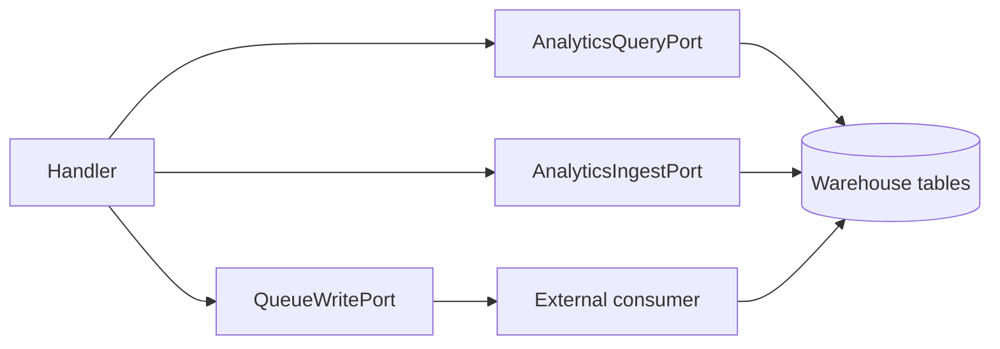

# Analytics contracts

Analytics contracts let handlers **query pre-provisioned warehouse tables or views** and,
optionally, **append small typed row batches**—without adopting document CRUD or an ETL framework.

Forze does not orchestrate pipelines, materialized views, or bulk loads. Use queue/stream/pubsub
for domain events and external loaders (Lane A); use `AnalyticsIngestPort` only for narrow
synchronous append (Lane B).

## Scope

| In scope | Out of scope |
|----------|----------------|
| Named, parameterized reads (`run`, `run_page`, `run_chunked`, …) | OLTP aggregates (`DocumentQueryPort`) |
| Optional `append` ingest rows | Airflow-style DAGs, CDC, sink topology |
| `ctx.analytics.query` / `ctx.analytics.ingest` | Raw SQL strings on application ports |
| BigQuery (`forze_bigquery`), ClickHouse (`forze_clickhouse`), Postgres (`forze_postgres` analytics routes), future RisingWave | RisingWave used as Postgres OLTP (`Document*`) |

## `AnalyticsSpec`

| Section | Details |
|---------|---------|
| Purpose | Declares read model, named queries, and optional ingest row type. |
| Import path | `from forze.application.contracts.analytics import AnalyticsSpec, AnalyticsQueryDefinition` |
| Type parameters | `R` (read row), `I` (ingest row, optional). |
| Required fields | `name`, `read`, `queries` (at least one entry). |
| Optional fields | `ingest` — when set, enables `AnalyticsIngestPort` for the route. |
| Related dependency keys | `AnalyticsQueryDepKey`, `AnalyticsIngestDepKey`. |

| Field | Type | Notes |
|-------|------|-------|
| `name` | `str \| StrEnum` | Logical route; matches integration module config keys. |
| `read` | `type[R]` | Default Pydantic model for query rows. |
| `queries` | `Mapping[str, AnalyticsQueryDefinition]` | `query_key` → parameter model. |
| `ingest` | `type[I] \| None` | Append row model; `None` disables ingest. |

Physical dataset/table names belong in integration config (e.g. `BigQueryDepsModule`, `ClickHouseDepsModule`),
not on the kernel spec.

## `AnalyticsQueryDefinition`

| Field | Type | Notes |
|-------|------|-------|
| `params` | `type[BaseModel]` | Parameters for `run*` methods. |
| `description` | `str \| None` | Documentation only. |

## `AnalyticsQueryPort`

Result shape and pagination mode are encoded in the method name (same convention as search):

| Method | Returns |
|--------|---------|
| `run` | `CountlessPage[R]` |
| `run_page` | `Page[R]` (total count when adapter supports it) |
| `run_chunked` | `AsyncIterator[Sequence[R]]` |
| `project_run` / `project_run_page` / `project_run_chunked` | `JsonDict` rows |
| `select_run` / … | explicit `return_type` |
| `run_cursor` / `project_run_cursor` / `select_run_cursor` | `CursorPage` |

Pass `AnalyticsRunOptions` (`dry_run`, `max_rows`, `timeout`) per request; adapters interpret them.

### `AnalyticsRunOptions` by engine

| Option | BigQuery | ClickHouse | Postgres |
|--------|----------|------------|----------|
| `timeout` | HTTP / job poll budget | `max_execution_time` (seconds) | `SET LOCAL statement_timeout` (seconds) |
| `max_rows` | Caps rows returned | Caps rows returned | Caps rows returned |
| `dry_run` | BigQuery API dry-run (bytes on client result) | Skips execution (empty pages; no cost estimate) | Skips execution (empty pages) |

Prefer `run` or `run_cursor` for large scans; `run_page` runs an extra COUNT unless `skip_total: true` is set on the query config.

## `AnalyticsIngestPort`

| Method | Purpose |
|--------|---------|
| `append(rows)` | Append a batch; returns `AnalyticsAppendResult` (`accepted`, optional `rejected`, `errors`). |

Register `AnalyticsIngestDepKey` only when ingest is required. Mock adapter raises if `spec.ingest`
is unset.

## Resolving ports

    :::python
    from forze.application.contracts.analytics import (
        AnalyticsQueryDefinition,
        AnalyticsSpec,
    )

    class DailyParams(BaseModel):
        day: str

    class EventRow(BaseModel):
        event: str

    class MetricRow(BaseModel):
        value: int

    spec = AnalyticsSpec(
        name="events",
        read=MetricRow,
        queries={"daily": AnalyticsQueryDefinition(params=DailyParams)},
        ingest=EventRow,
    )

    async with runtime.session() as ctx:
        q = ctx.analytics.query(spec)
        page = await q.run_page("daily", DailyParams(day="2026-01-01"))
        await ctx.analytics.ingest(spec).append([EventRow(event="signup")])

## Implementations

| Package | Notes |
|---------|-------|
| `forze_mock` | `MockAnalyticsAdapter` — seeded query hits and ingest log in `MockState` |
| `forze_bigquery` | `BigQueryAnalyticsAdapter` — Standard SQL, streaming insert, emulator support |
| `forze_clickhouse` | `ClickHouseAnalyticsAdapter` — server-side `{name:Type}` params, offset cursors, insert ingest |
| `forze_postgres` | `PostgresAnalyticsAdapter` — psycopg `%(name)s` params, offset/keyset cursors, batch insert ingest |

### Mock adapter

`MockAnalyticsAdapter` reads seeded rows from `MockState.analytics_query_hits[route][query_key]`
and writes ingest payloads to `MockState.analytics_ingest_log[route]`. See
[Mock integration](../../integrations/mock.md).

### BigQuery adapter

`BigQueryDepsModule` maps each `AnalyticsSpec` route to dataset, SQL templates, and optional
`ingest_table`. See [BigQuery integration](../../integrations/bigquery.md).

### ClickHouse adapter

`ClickHouseDepsModule` maps each `AnalyticsSpec` route to database, SQL templates, and optional
`ingest_table`. See [ClickHouse integration](../../integrations/clickhouse.md).

### Postgres adapter

`PostgresDepsModule.analytics` maps each `AnalyticsSpec` route to schema, SQL templates with
`%(param)s` placeholders, and optional `ingest_table`. See [PostgreSQL integration](../../integrations/postgres.md#analytics).

## Related pages

- [Contracts overview](../contracts.md)
- [Queue contracts](queue.md) — Lane A event handoff
- [Stream contracts](stream.md) — ordered append log
- [BigQuery integration](../../integrations/bigquery.md)
- [ClickHouse integration](../../integrations/clickhouse.md)
- [PostgreSQL integration](../../integrations/postgres.md#analytics)
