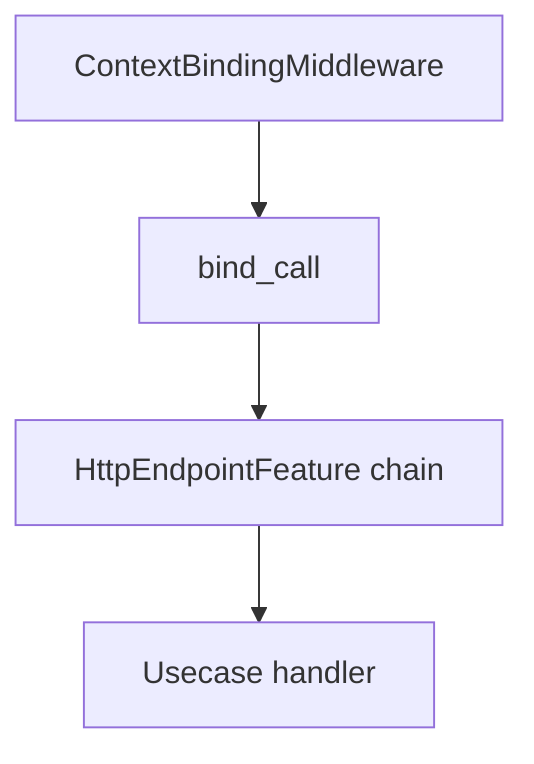

# Authn, authz, and tenancy with FastAPI

This recipe describes how Forze separates **boundary authentication** (who is calling), **tenant context** (which partition applies), and **authorization** (what they may do), and how to combine them safely in a FastAPI app.

## Two trust boundaries

1. **ASGI / FastAPI boundary** — `ContextBindingMiddleware` resolves `AuthnIdentity` and optional `TenantIdentity`, then `ExecutionContext.bind_call` stores them for the request. Downstream code should read `ctx.get_authn_identity()` / `ctx.get_tenancy_identity()`, not re-parse headers everywhere.
2. **Route / use case boundary** — Optional `HttpEndpointFeaturePort` wrappers (for example `RequireAuthnFeature`, `RequirePermissionFeature`) can enforce policy **after** the execution context exists but **before** the use case runs (fast-fail at the HTTP edge). Prefer **authoritative** checks on the usecase plan via :func:`~forze.application.guards.authz.authz_permission_guard_factory` so non-HTTP callers hit the same rules. Align OpenAPI with the same `AuthzPermissionRequirement` using `HttpMetadataSpec` (`dependencies`, `openapi_extra`) on `build_http_endpoint_spec` / `attach_http_endpoint` (see below).



## Without tenancy

- Register **authn** and **authz** dep routes on the kernel `Deps` (`AuthnDepsModule`, `AuthzDepsModule`, document stores for auth specs).
- Use `HeaderAuthnIdentityResolver` (or `CookieAuthnIdentityResolver`) for credentials.
- For tenant, you must still configure **exactly one** tenant strategy on the middleware: for example `TenantIdentityResolver(required=False)` with **no** `TenantResolverDepKey` registered, so `TenantIdentity` stays `None`.
- Call `AuthzPort.permits(..., tenant_id=None)` unless you scope policy by tenant.

## With tenancy

- Resolve tenant with `TenantIdentityResolver` (merges optional JWT `tid`, optional header hint, optional `TenantResolverPort`).
- Keep **authentication document routes** on **tenant-unaware** document clients until `TenantIdentity` is known (see `AUTHN_TENANT_UNAWARE_DOCUMENT_SPEC_NAMES` in `forze_authn.application` and [Multi-tenancy](../concepts/multi-tenancy.md)).
- Pass `tenant_id` into `permits` / other authz ports from `ctx.get_tenancy_identity().tenant_id` when your policy store is partitioned.

## Credential sources on the boundary

- `HeaderAuthnIdentityResolver` supports **Authorization bearer** and **API key** headers. Control **order** with `try_sources` (for example `("api_key", "token")` to prefer API keys). If both raw credentials are present, `when_multiple_credentials="reject"` raises `AuthenticationError` with `code="ambiguous_credentials"` instead of picking one silently. The `scheme` (Authorization) and `prefix` (API key) parts are forwarded to verifiers as **routing hints** — verifiers decide whether to consult them, and the JWT signature/claims (or HMAC tag) are the actual security boundary.
- `CookieAuthnIdentityResolver` reads an access token from a named cookie into `TokenCredentials`. Cookie bearer has **CSRF** implications for browser clients; prefer `HttpOnly` + `SameSite` and avoid using cookie access tokens for state-changing requests without anti-CSRF tokens, or restrict cookies to non-browser clients.

## Kernel wiring (sketch)

Merge document deps with `AuthnDepsModule(...)()` and `AuthzDepsModule(...)()`, then build `ExecutionContext(deps=merged)`.

## FastAPI wiring (sketch)

```python
from forze.application.contracts.authn import AuthnSpec
from forze_fastapi.middlewares.context import (
    ContextBindingMiddleware,
    HeaderAuthnIdentityResolver,
)
from forze_fastapi.middlewares.context.tenancy import TenantIdentityResolver

api_authn = AuthnSpec(
    name="api",
    enabled_methods=frozenset({"token"}),
)

app.add_middleware(
    ContextBindingMiddleware,
    ctx_dep=get_ctx,
    authn_identity_resolver=HeaderAuthnIdentityResolver(
        spec=api_authn,
        when_multiple_credentials="reject",
    ),
    tenant_identity_resolver=TenantIdentityResolver(required=False),
)
```

`AuthnSpec.enabled_methods` is the contract between the boundary and the configured verifier set: the orchestrator raises `AuthenticationError` if a request supplies a credential family that the spec does not advertise. The optional `token_profile` / `password_profile` / `api_key_profile` / `resolver_profile` fields select named verifier/resolver implementations registered by `AuthnDepsModule` — see [Authentication pipeline](../concepts/authentication.md) and [External IdPs over OIDC](external-idp-oidc.md).

## Usecase-level authz and OpenAPI alignment

- Register **guards** on `UsecasePlan` (for example `plan.before("ns.op", authz_permission_guard_factory(authz_spec, requirement))`, or `before_pipeline` for several factories) using a single frozen :class:`~forze.application.guards.authz.AuthzPermissionRequirement` instance.
- Reuse that **same** `AuthzPermissionRequirement` in HTTP metadata so clients see the right contract:

```python
from fastapi import Depends
from forze.application.contracts.authz import AuthzSpec
from forze.application.execution import UsecasePlan
from forze.application.guards.authz import AuthzPermissionRequirement, authz_permission_guard_factory
from forze_fastapi.openapi.security import http_bearer_scheme, openapi_http_bearer_scheme, openapi_operation_security

authz_spec = AuthzSpec(name="api")
requirement = AuthzPermissionRequirement(permission_key="widgets.read", authz_route="api")

plan = UsecasePlan().before(
    "widgets.read",
    authz_permission_guard_factory(authz_spec, requirement),
)

bearer = http_bearer_scheme(auto_error=False)
metadata = {
    "dependencies": [Depends(bearer)],
    "openapi_extra": openapi_operation_security("httpBearer"),
}
# Pass ``metadata`` into ``build_http_endpoint_spec(..., metadata=metadata)`` for custom routes.
# Merge ``openapi_http_bearer_scheme()`` into ``app.openapi_schema["components"]["securitySchemes"]`` once.
```

OpenAPI cannot be inferred from arbitrary guard callables; **sharing** `AuthzPermissionRequirement` (or an `AuthzOpRequirementMap` keyed by operation) keeps enforcement and documentation aligned; add tests that every HTTP-exposed operation has matching plan guards and metadata.

## Generated routes and default guards

Pass `default_http_features` into `attach_document_endpoints` / `attach_search_endpoints` to prepend guards (for example `RequireAuthnFeature()`, `RequirePermissionFeature(...)`) to every generated endpoint spec without editing each builder. Defaults remain **off** if you omit the argument.

## Optional template routes

`attach_oauth2_password_token_template_routes` registers minimal **login** and **refresh** JSON routes over `AuthnPort` and `TokenLifecyclePort` (the latter now lives in `forze.application.contracts.authn_lifecycle`). The implementation of `AuthnPort` provided by `forze_authn` is `AuthnOrchestrator`, which composes credential-family verifiers with a principal resolver — see [Authentication pipeline](../concepts/authentication.md). Treat the template routes as a **starter kit**: add rate limiting, abuse protection, and logging in your application.

The `ctx_dep` callable must be annotated with a concrete return type (for example `def get_ctx() -> ExecutionContext:`) so FastAPI treats it as a dependency rather than trying to parse `ExecutionContext` from the request.

## OpenAPI

Use `http_bearer_scheme`, `openapi_http_bearer_scheme`, `openapi_api_key_cookie_scheme`, `openapi_operation_security`, and `extract_bearer_token_or_raise` from `forze_fastapi.openapi.security` to align route `dependencies` with `components.securitySchemes` for Bearer JWTs or cookie-held tokens.
