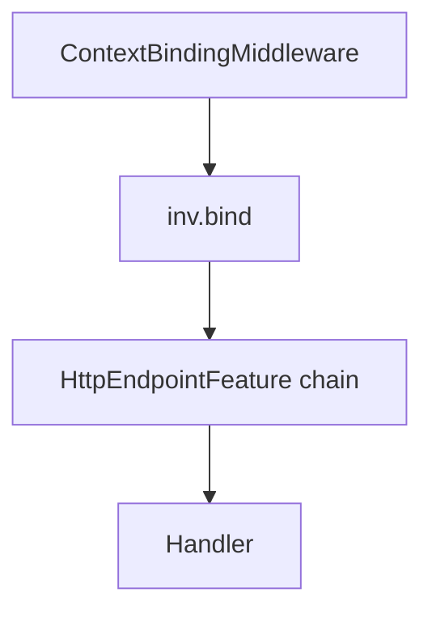

# Authn, authz, and tenancy with FastAPI

This recipe describes how Forze separates **boundary authentication** (who is calling), **tenant context** (which partition applies), and **authorization** (what they may do), and how to combine them safely in a FastAPI app.

## Two trust boundaries

1. **ASGI / FastAPI boundary** — `ContextBindingMiddleware` resolves `AuthnIdentity` and optional `TenantIdentity`, then `ctx.inv.bind(...)` stores them for the request. Downstream code should read `ctx.inv.get_authn()` / `ctx.inv.get_tenant()`, not re-parse headers everywhere.
2. **Route / handler boundary** — Optional `HttpEndpointFeaturePort` wrappers (for example `RequireAuthnFeature`, `RequireTenantFeature`) can enforce policy **after** the execution context exists but **before** the handler runs (fast-fail at the HTTP edge). Prefer **authoritative** checks on the operation plan via `BeforeStep` hooks that call `AuthzPort.permits` so non-HTTP callers hit the same rules. Align OpenAPI with `HttpMetadataSpec` (`dependencies`, `openapi_extra`) on `build_http_endpoint_spec` / `attach_http_endpoint` (see below).



## Without tenancy

- Register **authn** and **authz** dep routes on the kernel `Deps` (`AuthnDepsModule`, `AuthzDepsModule`, document stores for auth specs).
- Use one or more of `HeaderTokenAuthnIdentityResolver` / `HeaderApiKeyAuthnIdentityResolver` / `CookieTokenAuthnIdentityResolver` for credentials.
- For tenant, you must still configure **exactly one** tenant strategy on the middleware: for example `TenantIdentityResolver(required=False)` with **no** `TenantResolverDepKey` registered, so `TenantIdentity` stays `None`.
- Call `AuthzPort.permits(..., tenant_id=None)` unless you scope policy by tenant.

## With tenancy

- Resolve tenant with `TenantIdentityResolver` (merges optional JWT `tid`, optional header hint, optional `TenantResolverPort`).
- Keep **authentication document routes** on **tenant-unaware** document clients until `TenantIdentity` is known (see `AUTHN_TENANT_UNAWARE_DOCUMENT_SPEC_NAMES` in `forze_authn.application` and [Multi-tenancy](../concepts/multi-tenancy.md)).
- Pass `tenant_id` into `permits` / other authz ports from `ctx.inv.get_tenant().tenant_id` when your policy store is partitioned.

## Credential sources on the boundary

`ContextBindingMiddleware` accepts a sequence of single-source resolvers (`authn_identity_resolvers`); the **order** of the sequence is the precedence order, and the `when_multiple_credentials` policy decides what happens when more than one resolver returns an identity for the same request:

- `HeaderTokenAuthnIdentityResolver` reads bearer tokens from a configurable header (default `Authorization`). The `scheme` part of the header is forwarded to verifiers as a **routing hint** — the JWT signature/claims (or opaque-token verifier) remain the actual security boundary.
- `HeaderApiKeyAuthnIdentityResolver` reads API keys from a configurable header (default `X-API-Key`). The optional `prefix:key` shape lets verifiers route to per-prefix profiles.
- `CookieTokenAuthnIdentityResolver` reads an access token from a named cookie into `AccessTokenCredentials`. Cookie bearer has **CSRF** implications for browser clients; prefer `HttpOnly` + `SameSite` and avoid using cookie access tokens for state-changing requests without anti-CSRF tokens, or restrict cookies to non-browser clients.

Set `when_multiple_credentials="reject"` to raise `AuthenticationError(code="ambiguous_credentials")` when more than one resolver succeeds; the default `"first_in_order"` short-circuits on the first hit.

## Kernel wiring (sketch)

Merge document deps with `AuthnDepsModule(...)()` and `AuthzDepsModule(...)()`, then build `ExecutionContext(deps=merged)`.

## FastAPI wiring (sketch)

```python
from forze.application.contracts.authn import AuthnSpec
from forze_fastapi.middlewares.context import (
    ContextBindingMiddleware,
    HeaderApiKeyAuthnIdentityResolver,
    HeaderTokenAuthnIdentityResolver,
)
from forze_fastapi.middlewares.context.tenancy import TenantIdentityResolver

api_authn = AuthnSpec(
    name="api",
    enabled_methods=frozenset({"token", "api_key"}),
)

app.add_middleware(
    ContextBindingMiddleware,
    ctx_dep=get_ctx,
    authn_identity_resolvers=(
        HeaderTokenAuthnIdentityResolver(spec=api_authn),
        HeaderApiKeyAuthnIdentityResolver(spec=api_authn),
    ),
    when_multiple_credentials="reject",
    tenant_identity_resolver=TenantIdentityResolver(required=False),
)
```

`AuthnSpec.enabled_methods` is the contract between the boundary and the configured verifier set: the orchestrator raises `AuthenticationError` if a request supplies a credential family that the spec does not advertise. The optional `token_profile` / `password_profile` / `api_key_profile` / `resolver_profile` fields select named verifier/resolver implementations registered by `AuthnDepsModule` — see [Authentication pipeline](../concepts/authentication.md) and [External IdPs over OIDC](external-idp-oidc.md).

## Operation-plan authz and OpenAPI alignment

Register **authorization** on the frozen registry with `BeforeStep` hooks that resolve `AuthzPort` from `ctx.deps` and call `permits`. Use capability metadata when authz depends on a prior “principal present” step (see [Capability execution](../reference/capability-execution.md)):

```python
from forze.application.contracts.authz import AuthzSpec
from forze.application.contracts.authz.ports import AuthzPort
from forze.application.contracts.execution import BeforeStep
from forze.application.execution import OperationRegistry

def authz_factory(ctx, *, authz: AuthzPort, permission: str):
    async def _before(_args) -> None:
        identity = ctx.inv.get_authn()
        tenant = ctx.inv.get_tenant()
        tid = tenant.tenant_id if tenant else None
        if identity is None or not await authz.permits(identity, permission, tenant_id=tid):
            raise PermissionError(permission)
    return _before

registry = (
    OperationRegistry(handlers={"widgets.read": read_factory})
    .bind("widgets.read")
    .bind_outer()
    .before(
        BeforeStep(
            id="authz",
            factory=lambda ctx: authz_factory(ctx, authz=..., permission="widgets.read"),
            requires=("authn.principal",),
        ),
    )
    .finish(deep=True)
    .freeze()
)
```

For HTTP routes, mirror the same transport in OpenAPI:

```python
from fastapi import Depends
from forze_fastapi.openapi.security import http_bearer_scheme, openapi_operation_security

bearer = http_bearer_scheme(auto_error=False)
metadata = {
    "dependencies": [Depends(bearer)],
    "openapi_extra": openapi_operation_security("httpBearer"),
}
# Pass metadata into build_http_endpoint_spec(..., metadata=metadata) for custom routes.
```

Wire `forze_authz` via `AuthzDepsModule` and document-backed policy stores — see [Authentication reference](../reference/authentication.md).

## Generated routes and default features

Pass `default_http_features` into `attach_document_endpoints` / `attach_search_endpoints` / `attach_storage_endpoints` to prepend features (for example `RequireAuthnFeature()`, `RequireTenantFeature()`) to every generated endpoint spec without editing each builder. Defaults remain **off** if you omit the argument.

### Base `AuthnRequirement` on document / search specs

`DocumentEndpointsSpec` and `SearchEndpointsSpec` accept a top-level `authn: AuthnRequirement` key that is applied to **every** generated endpoint. Per-endpoint values in `SimpleHttpEndpointSpec["authn"]` still take precedence on the matching route, so the base is a starting point — not a hard ceiling:

```python
from forze_fastapi.endpoints.http import AuthnRequirement
from forze_fastapi.endpoints.document import attach_document_endpoints

api_authn = AuthnRequirement(authn_route="api", token_header="Authorization")
admin_authn = AuthnRequirement(authn_route="api", api_key_header="X-Admin-Key")

attach_document_endpoints(
    router,
    document=project_spec,
    dtos=project_dtos,
    registry=project_registry,
    ctx_dep=get_ctx,
    endpoints={
        "get_": True,
        "list_": True,
        "create": True,
        # Per-endpoint override — uses ``admin_authn`` instead of the base.
        "kill": {"authn": admin_authn},
        # Base requirement inherited by every endpoint above that does not
        # supply its own ``authn`` override.
        "authn": api_authn,
    },
)
```

Each route also gets the matching OpenAPI security scheme (bearer / cookie / API-key header) merged into its operation, so the `/docs` and `/redoc` UIs reflect the declared transport without any extra wiring.

### Dependency helper for hand-rolled routers

Use `build_authn_requirement_dependency` when you want to mirror the same authentication surface on a custom `APIRouter` (for example because your route is not a document/search CRUD operation). The helper returns a `Depends(...)` that:

- Reads `ExecutionContext` via your `ctx_dep` and raises HTTP 401 when no `AuthnIdentity` is bound (the binding still happens once, in `ContextBindingMiddleware`).
- Declares the matching FastAPI security class (`HTTPBearer` / `APIKeyCookie` / `APIKeyHeader`) so the operation shows up under the same `components.securitySchemes` entry as Forze-built endpoints.

```python
from fastapi import APIRouter, Depends
from forze_fastapi.endpoints.http import (
    AuthnRequirement,
    build_authn_requirement_dependency,
)

api_authn = AuthnRequirement(authn_route="api", token_header="Authorization")

router = APIRouter(
    prefix="/projects",
    dependencies=[
        build_authn_requirement_dependency(api_authn, ctx_dep=get_ctx),
    ],
)


@router.post("/archive")
async def archive_project(project_id: str) -> None:
    ...
```

Attach the dependency at the **router** level for the common case (every route shares the same authn surface) or per-route via `dependencies=[...]` on `@router.get / @router.post / ...` when a single endpoint needs a different requirement than its siblings.

## Pre-built authn endpoints

`attach_authn_endpoints` registers configurable **login**, **refresh**, **logout**, and **change-password** routes resolved from a frozen authn registry:

```python
from fastapi import APIRouter
from forze.application.composition.authn import AuthnKernelOp, build_authn_registry
from forze_fastapi.endpoints.authn import (
    CookieTokenTransportSpec,
    HeaderTokenTransportSpec,
    attach_authn_endpoints,
)

reg = build_authn_registry(api_authn)
ops = [api_authn.default_namespace.key(op) for op in AuthnKernelOp]
registry = reg.bind(*ops).bind_tx().set_route("postgres").finish(deep=True).freeze()

router = APIRouter(prefix="/auth")
attach_authn_endpoints(
    router,
    spec=api_authn,
    registry=registry,
    ctx_dep=get_ctx,
    endpoints={
        "password_login": True,
        "refresh": True,
        "logout": True,
        "change_password": True,
        "config": {
            "access_token_transport": HeaderTokenTransportSpec(
                kind="header",
                header_name="Authorization",
                scheme="Bearer",
            ),
            "refresh_token_transport": CookieTokenTransportSpec(
                kind="cookie",
                cookie_name="refresh_token",
            ),
        },
    },
)
```

Password login uses `application/x-www-form-urlencoded` so first-party login forms post directly. The matching `TokenTransportInputFeature` reads the refresh token from the configured transport on `/refresh`; the `TokenTransportOutputFeature` sets cookies on issue and clears them on logout.

Logout and change-password are auto-protected by an `AuthnRequirement` derived from the access transport unless the caller explicitly supplies one in the `SimpleHttpEndpointSpec` for the endpoint. The password-login handler wired by `forze_authn` uses `AuthnOrchestrator`, which composes credential-family verifiers with a principal resolver — see [Authentication pipeline](../concepts/authentication.md). Treat the pre-built routes as a **starter kit**: add rate limiting, abuse protection, and logging in your application.

The `ctx_dep` callable must be annotated with a concrete return type (for example `def get_ctx() -> ExecutionContext:`) so FastAPI treats it as a dependency rather than trying to parse `ExecutionContext` from the request.

## OpenAPI

Use `http_bearer_scheme`, `openapi_http_bearer_scheme`, `openapi_api_key_cookie_scheme`, `openapi_operation_security`, and `extract_bearer_token_or_raise` from `forze_fastapi.openapi.security` to align route `dependencies` with `components.securitySchemes` for Bearer JWTs or cookie-held tokens.
