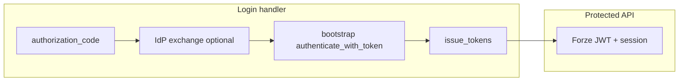

# External bootstrap → Forze JWT

Use this recipe when users sign in through an external OIDC IdP (Google, VK ID, Telegram Login, corporate SSO) and your **steady-state API** should accept **first-party Forze JWTs** (with optional session enforcement), not vendor tokens on every request.

## Pattern

1. **Bootstrap route** — validates the external `id_token` (or a token you obtained server-side after code exchange) via a preset `TokenVerifierPort` from `forze_identity.builtin.idp.*`.
2. **API route** — validates Forze-issued access tokens via `AuthnKernelConfig(access_token_secret=..., refresh_token_pepper=...)` and the default `ForzeJwtTokenVerifier`.
3. **Login handler** — after bootstrap auth resolves a `PrincipalIdentity`, call `TokenLifecyclePort.issue_tokens(identity)` to mint Forze access/refresh tokens for the client.
4. **Middleware** — bind `HeaderTokenAuthnIdentityResolver` only to the **API** `AuthnSpec` so vendor JWTs never hit protected resources by mistake.



## Wiring sketch

```python
from forze.application.execution import Deps, DepsRegistry
from forze_identity.authn import AuthnDepsModule, AuthnKernelConfig
from forze_identity.builtin.idp.google import GoogleOidcConfig, google_identity_deps

google_bootstrap = google_identity_deps(
    GoogleOidcConfig(client_id="..."),
    authn_route="bootstrap",
)

api_authn = AuthnDepsModule(
    kernel=AuthnKernelConfig(
        access_token_secret=access_secret,
        refresh_token_pepper=refresh_pepper,
    ),
    authn={"api": frozenset({"token"})},
)

deps_registry = DepsRegistry.from_modules(
    lambda: Deps.merge(google_bootstrap, api_authn()),
)
```

Routes without `token_verifiers` overrides use the first-party JWT verifier. The bootstrap route uses an empty kernel (no access-token secret) because it only registers an external OIDC verifier.

## Resolver choice

| Resolver | When |
|----------|------|
| `MappingTableResolver(provision_on_first_sight=True)` | Production SSO — stable internal UUID per `(issuer, subject)`. |
| `DeterministicUuidResolver` | Demos and tests — no mapping table required. |

Builtin presets default to `DeterministicUuidResolver`; pass `resolver=` to `oidc_bootstrap_identity_deps` or wrap presets when you need mapping-table behavior.

## Login handler flow

```python
# After VK/Telegram code exchange (optional):
# id_token = (await exchange_authorization_code(config, code=..., code_verifier=...)).id_token

identity = await authn_orchestrator.authenticate_with_token(
    AccessTokenCredentials(token=id_token),
    spec=AuthnSpec(name="bootstrap", enabled_methods=frozenset({"token"})),
)

issued = await token_lifecycle.issue_tokens(identity)
# Return issued.access_token to the client; use api route + Forze JWT on later calls.
```

## Per-IdP shortcuts

| IdP | Preset module | Code exchange |
|-----|---------------|---------------|
| Google Sign-In | `forze_identity.builtin.idp.google` | Client obtains `id_token` (GIS / mobile SDK); POST to your login handler |
| VK ID | `forze_identity.builtin.idp.vk` | `forze_identity.oauth.generate_pkce()` + `exchange_authorization_code()` |
| Telegram Login | `forze_identity.builtin.idp.telegram` | Same (`oauth` + exchange) |

Install: `pip install 'forze[oidc]'` (includes `pyjwt[crypto]` and `httpx` for exchange helpers).

## Learn more

- [External IdPs over OIDC](external-idp-oidc.md) — generic `OidcTokenVerifier` wiring
- [Google Sign-In (OIDC)](google-oidc.md)
- [VK ID (OIDC)](vk-id.md)
- [Telegram Login (OIDC)](telegram-login-oidc.md)
- [Integration — OIDC](../integrations/oidc.md)
